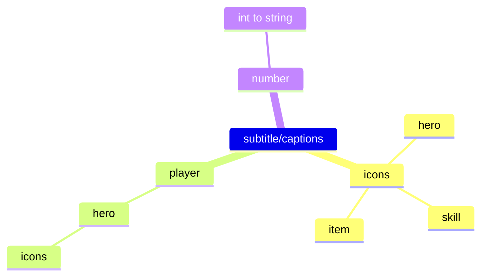

# Includes

```mermaid
    mindmap
    subtitle/captions
        icons
            hero
            skill
            item
        player
            hero
                icons
        number
            int to string
```

### Database
```json
{
    "key":"",
    "type":"skill/item/hero/player/team",
    "list":["XXX","AB","CD"]
}
```